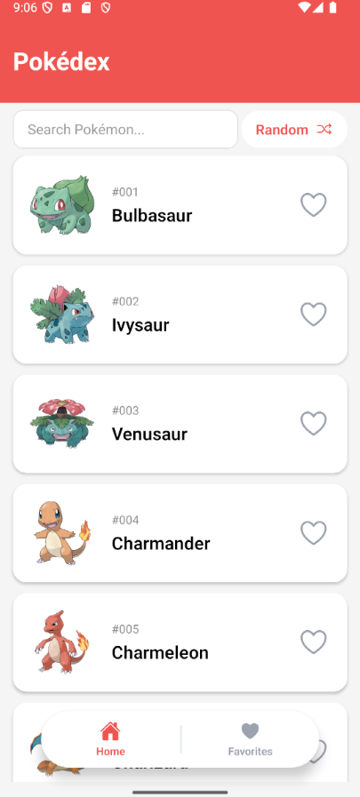
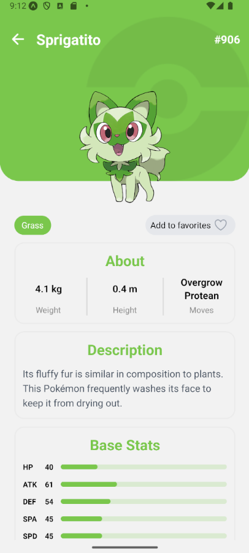
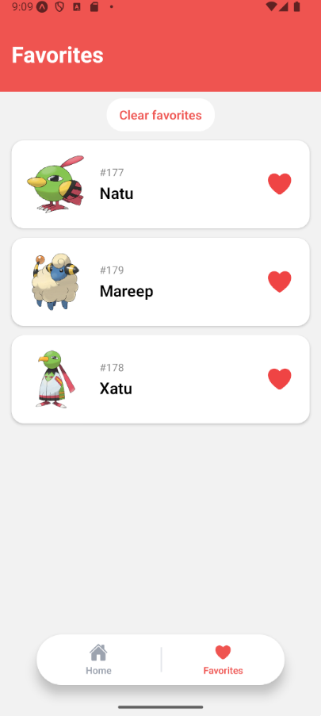

# Pokedex Challenge
<p align="center">
  
  
  
</p>
## Tecnologías utilizadas

- React Native
- Expo
- TypeScript
- React Navigation
- TanStack Query (React Query)
- Expo Image
- AsyncStorage
- Maestro (End-to-End Testing)

## Funcionalidades

- Listado de Pokémon con carga paginada (Infinite Scroll) y persistencia en local durante una semana.
- Búsqueda de Pokémon por nombre.
- Vista de detalle de cada Pokémon con animaciones de carga presentando información de estadísticas, tipos y características.
- Botón para navegar al detalle de un Pokémon aleatorio.
- Sistema de favoritos persistente mediante AsyncStorage, con listado y botón de eliminación total.
- Estados de carga, error y lista vacía.
- Imágenes con placeholder mediante Expo Image.
- Pruebas End-to-End utilizando Maestro.

## Consideraciones

- La búsqueda se realiza únicamente sobre los Pokémon que ya fueron cargados localmente. Esto se debe a que la PokeAPI no ofrece un endpoint para realizar búsquedas parciales por nombre.
- El botón de Pokémon aleatorio utiliza un rango de IDs del **1 al 1025**. Aunque la PokeAPI informa un `count` cercano a 1300, actualmente solo existen detalles disponibles hasta el Pokémon con ID **1025**. Si la API incorpora nuevos Pokémon en el futuro, será necesario actualizar la constante `MAX_POKEMON_ID` ubicada en `src/utils`.

## Como levantar la app
npm install
npx expo start --clear

## Como correr los tests E2E

### Configuración inicial de dev build

```bash
npx expo prebuild
npx expo run:android
```

### Iniciar la app

```bash
npm run dev
```

### Ejecutar los tests

```bash
npm run e2e
```